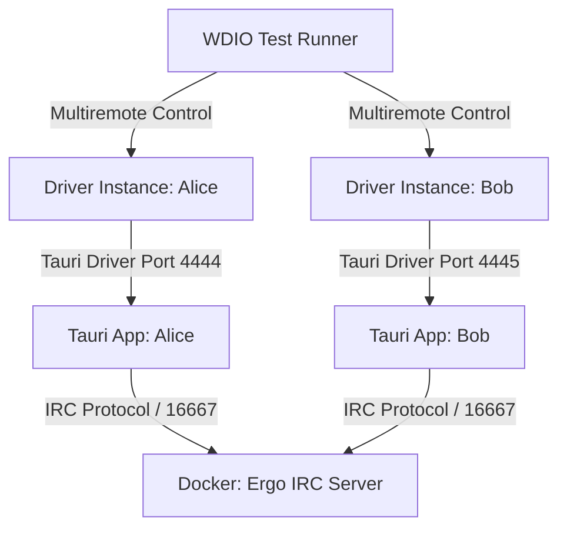

# E2E & Visual Testing Framework Documentation (Luna IRC)

Comprehensive guide covering the architecture, setup, multi-instance orchestration, and guidelines for writing simple and complex multi-stage E2E tests for the **Luna IRC** Tauri 2 (Rust + React) application.

---

## 1. Architecture & Testing Philosophy

Tests in diIRC do not rely on mock server responses. The core strategy is **verifying real application behavior in a fully integrated environment**, which includes:
1. **Real IRC Server**: Tests run a real **Ergo IRC** server inside a Docker container on custom port `16667`.
2. **Full Application Stack**: Real Rust backend coupled with React frontend loaded inside Tauri/WebKitGTK.
3. **Multi-Instance Orchestration (Multiremote)**: Simultaneous execution of multiple independent application instances (e.g., `Alice` and `Bob`) controlled within a single test scenario via WebdriverIO Multiremote.
4. **Multi-Stage Visual Regression Testing**: Automatic capture of exact DOM screenshots (PNGs) at designated execution stages.



---

## 2. Directory Structure (`test/`)

The test architecture is completely decoupled from the main application source code:

```text
test/
├── wdio.conf.js                # WebdriverIO configuration & lifecycle hooks (Docker, Vite, tauri-driver)
├── documentation.md            # Framework documentation
├── e2e/
│   ├── docker/
│   │   └── docker-compose.yml  # Ergo IRC container environment
│   ├── pageobjects/
│   │   └── chat.page.js        # Page Object Model (POM) for forms and chat views
│   └── specs/
│       └── chat.spec.js        # Multi-instance messaging test spec
└── reports/
    └── screenshots/            # Multi-stage PNG visual snapshots
        ├── alice-stage1-motd.png
        ├── bob-stage1-motd.png
        ├── alice-stage2-chat.png
        └── bob-stage2-chat.png
```

---

## 3. Data Isolation & Technical Workarounds

### a) Data Isolation (Alice vs. Bob)
To prevent parallel application instances from overwriting each other's configuration or local databases, `test/wdio.conf.js` sets isolated `XDG` environment variables per process:
- Alice: `/tmp/diirc-e2e-alice/data`, `/tmp/diirc-e2e-alice/config`
- Bob: `/tmp/diirc-e2e-bob/data`, `/tmp/diirc-e2e-bob/config`

This mechanism ensures complete instance isolation **without modifying a single line of Rust code (`src-tauri/src/lib.rs`)**.

### b) WebKitGTK Keyboard Flakiness Workaround
WebKitGTK on Linux can experience input flakiness when simulating keystrokes directly via WebDriver (`setValue`).
**Solution:** Form inputs and submissions are handled by updating DOM element values directly and dispatching React value trackers (`_valueTracker`) and DOM events (`input` & `submit`). Helper functions for this pattern are located in `test/e2e/pageobjects/chat.page.js`.

### c) Reliable Visual Snapshots (Modern Screenshot)
Native `browser.saveScreenshot()` deadlocks WebKitGTK processes under Linux. OS-level screen capture tools capture the entire desktop environment (including IDE and terminal windows).
**Solution:** The test suite uses `modern-screenshot`, which is injected directly into the browser renderer context to export pixel-perfect DOM snapshots as PNG files without capturing system desktop UI.

---

## 4. Writing Test Scenarios

### a) Simple Test Scenario (Single Instance)
Example of testing a single UI component or form:

```javascript
import { expect } from 'chai';
import chatPage from '../pageobjects/chat.page.js';

describe('Simple View Test', () => {
  it('should display the login form inputs', async () => {
    // 1. Locate element via Page Object
    const inputName = await browser.$('input[name="name"]');
    
    // 2. Assertion
    expect(await inputName.isDisplayed()).to.be.true;
  });
});
```

---

### b) Complex Multi-Stage & Multi-Instance Scenario

Example pattern for orchestrating multiple actors with visual screenshots at distinct stages:

```javascript
import fs from 'node:fs';
import path from 'node:path';
import { createRequire } from 'node:module';
import { expect } from 'chai';
import chatPage from '../pageobjects/chat.page.js';

const require = createRequire(import.meta.url);

describe('Complex Multi-Stage Scenario', () => {
  // Helper function to capture screenshots at designated stages
  const takeStageScreenshots = async (stageName) => {
    const modernScreenshotCode = fs.readFileSync(
      require.resolve('modern-screenshot/dist/index.js'), 
      'utf8'
    );

    for (const [name, instance] of Object.entries({ alice: browser.alice, bob: browser.bob })) {
      const base64png = await instance.executeAsync((code, done) => {
        const script = document.createElement('script');
        script.textContent = code;
        document.head.appendChild(script);
        
        setTimeout(() => {
          if (window.modernScreenshot) {
            window.modernScreenshot.domToPng(document.body, { backgroundColor: '#1e1f22' })
              .then(done)
              .catch(err => done('ERROR: ' + err));
          } else {
            done('ERROR: Script not loaded');
          }
        }, 300);
      }, modernScreenshotCode);

      if (base64png && base64png.startsWith('data:image/png;base64,')) {
        const buffer = Buffer.from(base64png.split(',')[1], 'base64');
        const dest = path.resolve(`./test/reports/screenshots/${name}-${stageName}.png`);
        fs.mkdirSync(path.dirname(dest), { recursive: true });
        fs.writeFileSync(dest, buffer);
      }
    }
  };

  it('Multi-stage flow: Login -> MOTD Modal -> Message exchange', async function () {
    this.timeout(180000);

    // Step 1: Login both instances
    await chatPage.injectState(browser.alice, { nick: 'Alice' });
    await chatPage.injectState(browser.bob, { nick: 'Bob' });

    // STAGE 1: Capture screenshot with open MOTD Modal
    await takeStageScreenshots('stage1-motd');

    // Step 2: Dismiss MOTD Modal
    await chatPage.closeMotdModal(browser.alice);
    await chatPage.closeMotdModal(browser.bob);

    // Step 3: Send and receive message
    await chatPage.sendMessage(browser.alice, 'Test message');
    await chatPage.waitForMessage(browser.bob, 'Test message');

    // STAGE 2: Capture screenshot of main chat view after modal dismissal
    await takeStageScreenshots('stage2-chat');
  });
});
```

---

## 5. Running Tests

Ensure Docker service is running before executing tests.

To compile the application binary and run the complete E2E test suite:

```bash
npm run test:e2e
```

This command automatically handles:
1. Building the Tauri binary (`cargo build`).
2. Starting the Ergo IRC Docker container.
3. Launching the Vite dev server (`port 1420`).
4. Spawning dual `tauri-driver` instances for Alice (`port 4444`) and Bob (`port 4445`).
5. Running tests and saving visual screenshots to `test/reports/screenshots/`.
6. Performing clean teardown of processes and Docker containers upon completion.

---

## 6. Adding New Test Suites Step-by-Step

To create a brand-new end-to-end test scenario:

1. **Create Page Object (Optional)**: If introducing new UI elements or modals, create a helper in `test/e2e/pageobjects/<feature>.page.js`.
2. **Create Spec File**: Add a new specification file in `test/e2e/specs/<feature>.spec.js`.
3. **Automatic Discovery**: WebdriverIO automatically discovers any `.spec.js` or `.js` file inside `test/e2e/specs/` due to the configured glob pattern (`./e2e/specs/**/*.spec.js`).
4. **Execution**: Run `npm run test:e2e` to execute the full suite.

---

## 7. Execution Ordering & Future CI/CD Parallelization

### Local Execution: Sequential Processing (Current Standard)
When executing tests locally on a developer machine, multiple test specs are run **sequentially (one after another)**. This is enforced by `maxInstances: 1` in `test/wdio.conf.js`.

**Why Sequential Locally?**
1. **Port & Resource Isolation**: Prevents port conflicts for Docker containers (e.g. `16667`) and `tauri-driver` ports (`4444`, `4445`).
2. **Display Focus**: Prevents multiple active GUI windows from overlapping or interfering with renderer screenshots.
3. **Clean Teardown**: Ensures Docker environments and dev servers are cleanly started and stopped between distinct test suites.

### Multi-Server Testing via Dedicated Suite Configs
For test suites that require different backend servers (e.g. Ergo IRC vs ZNC Bouncer vs InspIRCd):
1. Create dedicated configuration files under `test/`:
   - `test/wdio.ergo.conf.js` (Ergo IRC server configuration)
   - `test/wdio.znc.conf.js` (ZNC Bouncer configuration)
2. Define sequential execution scripts in `package.json`:
   ```json
   "scripts": {
     "test:e2e:ergo": "npm run build:e2e && wdio run test/wdio.ergo.conf.js",
     "test:e2e:znc": "npm run build:e2e && wdio run test/wdio.znc.conf.js",
     "test:e2e:all": "npm run test:e2e:ergo && npm run test:e2e:znc"
   }
   ```

### Future CI/CD Parallelization (GitHub Actions Job Matrix)
In future CI/CD pipelines (GitHub Actions), test suites will be parallelized across isolated virtual runners using job matrices:

```yaml
# .github/workflows/e2e.yml
strategy:
  matrix:
    suite: [ergo, znc, inspircd]
steps:
  - run: npm run test:e2e:${{ matrix.suite }}
```
Each CI job runs in an isolated runner instance with its own display server and Docker daemon, achieving true parallelization without local port or window conflicts.

